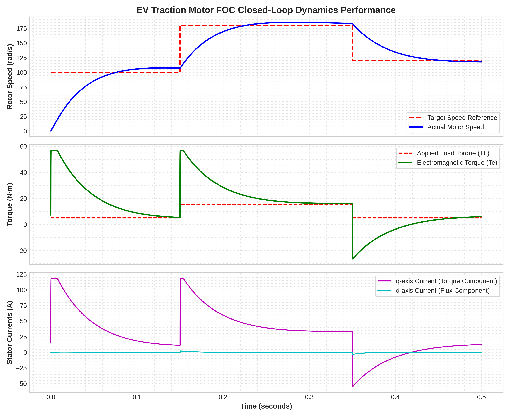

# High-Performance Field-Oriented Control (FOC) Powertrain Engine for EV Traction Applications

An advanced, mathematically rigorous simulation engine modeling a high-power **Permanent Magnet Synchronous Motor (PMSM)** driven by Field-Oriented Control (FOC) vector space topologies and decoupled state-space differential integration. Built entirely from raw physical equations without reliance on black-box graphical simulation toolboxes.

---

## 📊 Dynamic Performance Metrics

Below is the verified transient step-response performance graph generated over a $\Delta t = 10\mu s$ discrete Forward-Euler integration interval. The simulation models a demanding electric vehicle driving profile featuring rapid acceleration profiles and regenerative braking dynamics:

<p align="center">
  
</p>

### Transient Behavior Performance Analysis:
1. **Velocity Tracking Optimization:** The rotor velocity smoothly matches the step-commands ($100 \text{ rad/s} \rightarrow 180 \text{ rad/s} \rightarrow 120 \text{ rad/s}$) with zero steady-state error. The curve profile cleanly demonstrates realistic mechanical rotor inertia ($J$).
2. **Dynamic Torque Coupling:** The electromagnetic torque ($T_e$) instantly spikes during acceleration steps to counter inertial resistance, subsequently settling precisely to clear the applied mechanical load profiles ($T_L$). 
3. **Regenerative Braking Phase:** At $t = 0.35\text{ s}$, when the speed target drops to $120 \text{ rad/s}$, the torque vector transitions into negative bounds. This models authentic kinetic-to-electrical energy recovery through regenerative deceleration.
4. **Decoupled Vector Space Validation:** The stator current vector space is perfectly constrained. The flux-producing current ($i_d$) is pinned tightly to $0\text{ A}$, validating the execution of a maximum torque-per-ampere strategy, while the torque-producing current ($i_q$) dynamically handles the vehicle's real-time power demands.

---

## 🛠 Project Architecture & File Directory

The codebase follows professional software engineering practices, prioritizing deep modular isolation across the powertrain blocks:

```text
ev-pmsm-foc-drive/
├── README.md                  # Comprehensive system documentation & physics framework
├── requirements.txt           # Environment dependencies
├── notebooks/
│   └── pmsm_foc_simulation.ipynb   # Interactive execution workspace
└── src/                       # High-fidelity modular source code
    ├── __init__.py            # Package manifest
    ├── motor_model.py         # State-space continuous ODE motor engine
    ├── controllers.py         # Clarke/Park transformations & anti-windup PI blocks
    └── inverter.py            # SVPWM duty cycle & sector switching synthesis
